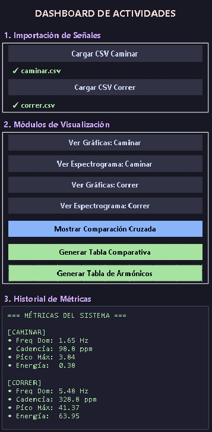
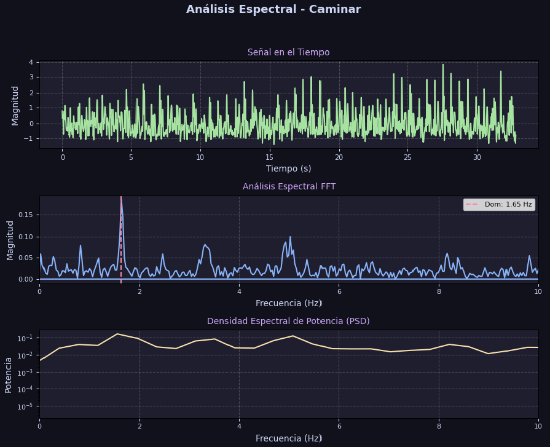
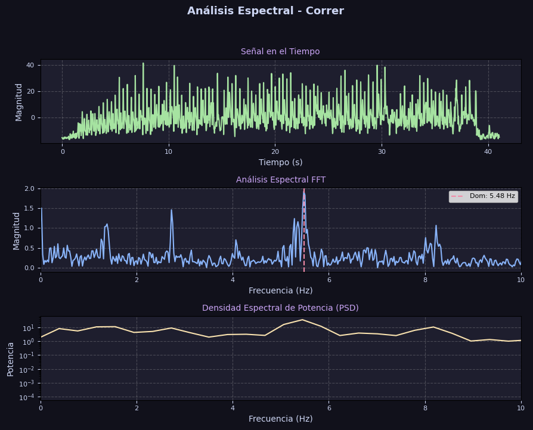
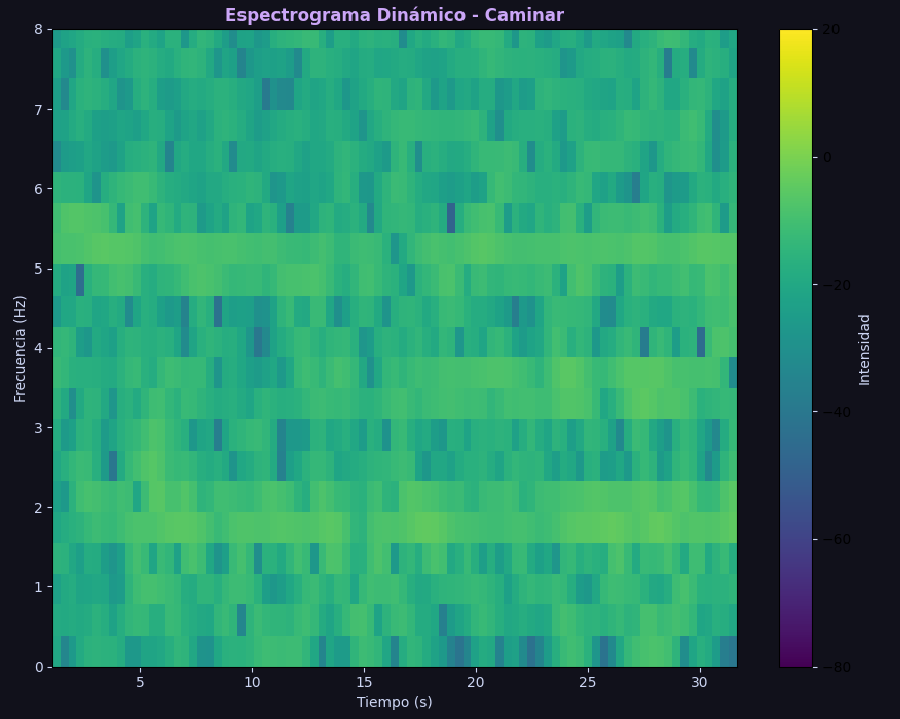
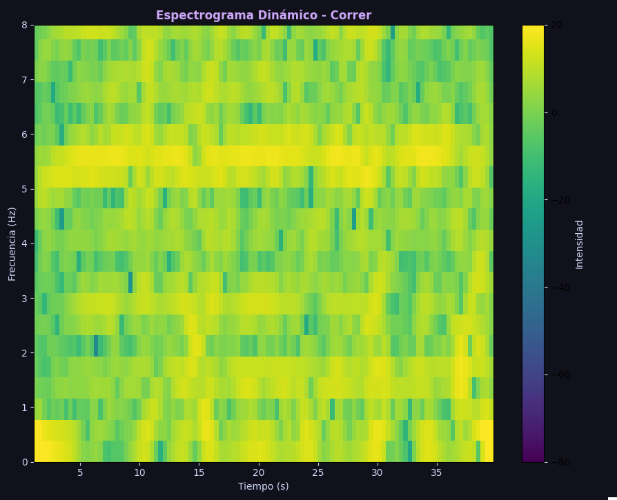
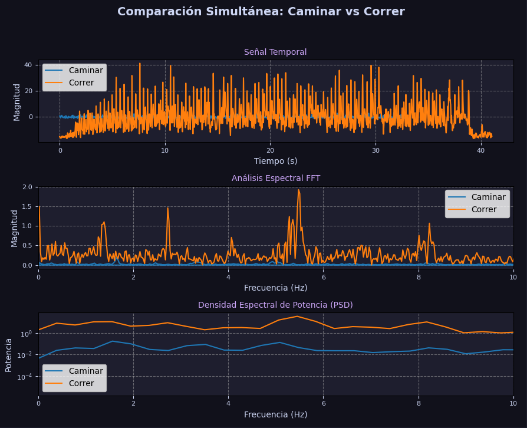
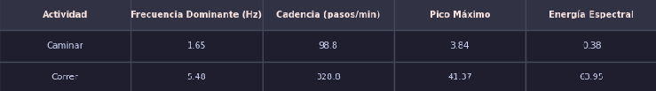
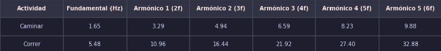

# Reporte Técnico: Análisis Espectral del Acelerómetro del Celular
---
## Datos Generales
 * **Universidad:** Universidad Autónoma de Baja California Sur
 * **Departamento:** Departamento Académico de Sistemas Computacionales 
 * **Integrantes:** 
    * Osmar Isaí Martínez Álvarez
    * Oscar Fernando Ramírez Morales
    * Luis Ernesto Núñez Sepúlveda
 * **Materia:** Matemáticas IV
 * **Profesor:** Miguel Ángel Norzagaray Cosío 
 * **Carrera:** Ingeniería en Tecnología Computacional 
 * **Semestre y Turno:** Cuarto semestre, Turno Matutino
 * **Fecha:** 25 de mayo del 2026
 * **Nombre del proyecto:** Análisis Espectral del Acelerómetro del Celular

---

## Introducción

El presente reporte describe el desarrollo de un sistema de análisis espectral aplicado a datos obtenidos mediante el acelerómetro de un celular. El objetivo principal del proyecto es comparar dos actividades físicas: caminar y correr, utilizando herramientas de procesamiento de señales en Python.

Los datos fueron registrados en archivos CSV y posteriormente procesados para obtener información relevante sobre el comportamiento del movimiento. Para ello, se emplearon conceptos como señal en el tiempo, magnitud vectorial, componente DC, Transformada Rápida de Fourier, frecuencia dominante, cadencia, densidad espectral de potencia, espectrogramas y armónicos.

El sistema desarrollado permite cargar los archivos correspondientes a cada actividad, analizar sus señales, visualizar gráficas, comparar resultados y generar tablas de métricas. Además, se implementó una interfaz gráfica en Tkinter para facilitar el uso del programa y hacer más clara la interpretación de los resultados.

---

## 1. Objetivo general

Desarrollar un programa en Python capaz de analizar datos del acelerómetro de un celular para comparar el comportamiento espectral de las actividades caminar y correr.

---

## 2. Objetivos específicos

* Leer archivos CSV generados con datos del acelerómetro.
* Procesar las señales de aceleración en los ejes X, Y y Z.
* Calcular la magnitud vectorial de la aceleración.
* Eliminar la componente DC de la señal.
* Aplicar la Transformada Rápida de Fourier para obtener el espectro de frecuencia.
* Identificar la frecuencia dominante de cada actividad.
* Calcular la cadencia aproximada en pasos por minuto.
* Obtener el pico máximo y la energía espectral.
* Generar gráficas de señal temporal, FFT y PSD.
* Crear espectrogramas para observar el comportamiento de las frecuencias en el tiempo.
* Comparar los resultados entre caminar y correr.
* Generar tablas comparativas y tablas de armónicos.

---

## 3. Marco teórico

### 3.1 Acelerómetro

Un acelerómetro es un sensor que mide la aceleración de un objeto en diferentes direcciones. En este proyecto se utilizaron los datos de aceleración registrados en tres ejes: X, Y y Z. Estos valores permiten representar el movimiento del celular durante actividades como caminar o correr.

El uso del acelerómetro permite obtener información sobre la intensidad, dirección y variación del movimiento. Por esta razón, sus datos pueden analizarse como señales para identificar patrones repetitivos en distintas actividades físicas.


### 3.2 Señal en el tiempo

Una señal en el tiempo muestra cómo cambia una magnitud conforme transcurre el tiempo. En este caso, la señal representa la variación de la aceleración registrada por el celular durante una actividad física.

En el proyecto, la señal temporal permite observar directamente los cambios de movimiento. Cuando la persona camina, la señal presenta variaciones más suaves. En cambio, cuando la persona corre, la señal presenta cambios más intensos y amplitudes mayores.

### 3.3 Magnitud vectorial

Como el acelerómetro registra datos en tres ejes, es necesario combinar esos valores en una sola señal. Para ello se calcula la magnitud vectorial de la aceleración.

La magnitud vectorial permite obtener una representación general del movimiento sin depender completamente de la orientación exacta del celular. Esta se calcula mediante la siguiente expresión:

$$
|a| = \sqrt{a_x^2 + a_y^2 + a_z^2}
$$

* Donde $|a|$ representa la magnitud vectorial de la aceleración.
* $a_x$ es la aceleración registrada en el eje X.
* $a_y$ es la aceleración registrada en el eje Y.
* $a_z$ es la aceleración registrada en el eje Z.

Este cálculo permite transformar las tres componentes del acelerómetro en una sola señal de análisis. En el programa, este procesamiento se realiza en el archivo `procesar_senal.py`.

### 3.4 Componente DC

La componente DC representa el valor promedio o constante de una señal. En señales de aceleración, esta componente puede deberse a la gravedad o a un desplazamiento base de la medición.

Para analizar mejor las variaciones del movimiento, se elimina la componente DC restando el valor promedio de la señal. Esto permite centrar la señal alrededor de cero y observar con mayor claridad los cambios producidos por caminar o correr.

$$
x_{ac} = x - \bar{x}
$$

* Donde $x_{ac}$ es la señal sin componente DC.
* $x$ es la señal original.
* $\bar{x}$ representa el valor promedio de la señal.

Eliminar la componente DC ayuda a que el análisis espectral se enfoque principalmente en las variaciones del movimiento y no en valores constantes de la señal.

### 3.5 Frecuencia de muestreo

La frecuencia de muestreo indica cuántas muestras de la señal se registran por segundo. En este proyecto se obtiene a partir del intervalo promedio entre muestras consecutivas del vector de tiempo.

$$
f_s = \frac{1}{\Delta t}
$$

* Donde $f_s$ es la frecuencia de muestreo.
* $\Delta t$ representa la diferencia promedio entre muestras consecutivas.

Este valor es importante porque permite relacionar los datos registrados con el tiempo real. Además, la frecuencia de muestreo se utiliza para calcular correctamente la FFT, la PSD y los espectrogramas.

### 3.6 Transformada Rápida de Fourier

La Transformada Rápida de Fourier, conocida como FFT, permite convertir una señal del dominio del tiempo al dominio de la frecuencia. Esto significa que, en lugar de observar únicamente cómo cambia la señal con el tiempo, se puede analizar qué frecuencias están presentes en el movimiento.

La FFT se representa mediante la siguiente expresión:

$$
X[k] = \sum_{n=0}^{N-1} x[n]e^{-j2\pi kn/N}
$$

* Donde $X[k]$ representa la componente de frecuencia obtenida.
* $x[n]$ es la señal en el dominio del tiempo.
* $N$ es el número total de muestras.
* $k$ es el índice de frecuencia.

En este proyecto, la FFT permite identificar la frecuencia dominante de cada actividad. Esta frecuencia representa el ritmo principal del movimiento, por ejemplo, el patrón repetitivo de los pasos al caminar o correr.

### 3.7 Ventana Hann

Antes de aplicar la FFT, se utiliza una ventana Hann para reducir fugas espectrales. Las fugas espectrales aparecen cuando una señal no encaja perfectamente dentro del intervalo de análisis, provocando que la energía se distribuya en frecuencias cercanas.

La ventana Hann se define como:

$$
w[n] = 0.5\left(1 - \cos\left(\frac{2\pi n}{N-1}\right)\right)
$$

* Donde $w[n]$ representa el valor de la ventana en la muestra $n$.
* $N$ es el número total de muestras de la señal.

Aplicar esta ventana mejora la calidad del análisis espectral, ya que suaviza los bordes de la señal antes de calcular la FFT.

### 3.8 Frecuencia dominante

La frecuencia dominante es la frecuencia con mayor magnitud dentro del espectro obtenido mediante la FFT. En este proyecto se interpreta como la frecuencia principal del movimiento.

$$
f_d = f\left(\arg\max(P_1)\right)
$$

* Donde $f_d$ representa la frecuencia dominante.
* $f$ es el vector de frecuencias.
* $P_1$ es la magnitud del espectro de un solo lado.

Una frecuencia dominante más baja suele relacionarse con movimientos más lentos, como caminar. Una frecuencia dominante más alta se relaciona con movimientos más rápidos, como correr.

### 3.9 Cadencia

La cadencia representa una aproximación del número de pasos o ciclos de movimiento por minuto. En el programa se calcula multiplicando la frecuencia dominante por 60.

$$
\text{Cadencia} = f_d \cdot 60
$$

* Donde $f_d$ representa la frecuencia dominante de la señal.
* El factor $60$ permite convertir ciclos por segundo a ciclos por minuto.

Esta métrica ayuda a interpretar el ritmo de la actividad física de una forma más entendible, ya que expresa el movimiento en pasos o repeticiones por minuto.

### 3.10 Pico máximo

El pico máximo representa la mayor amplitud registrada en la señal procesada. Este valor permite identificar qué tan intensa fue la variación máxima del movimiento durante la actividad.

$$
P_{\text{máx}} = \max(|x_{ac}|)
$$

* Donde $P_{\text{máx}}$ representa el pico máximo.
* $x_{ac}$ es la señal procesada sin componente DC.

Un pico máximo mayor indica que la señal presentó aceleraciones más fuertes. Por esta razón, se espera que la actividad de correr tenga un pico máximo más alto que la actividad de caminar.

### 3.11 Energía espectral

La energía espectral mide la cantidad total de energía presente en el espectro de frecuencia. En este proyecto se calcula sumando los cuadrados de las magnitudes obtenidas mediante la FFT.

$$
E = \sum_{k=0}^{N} P_1[k]^2
$$

* Donde $E$ representa la energía espectral.
* $P_1[k]$ corresponde a la magnitud del espectro en cada componente de frecuencia.
* $N$ es el número total de muestras consideradas.

Una energía espectral mayor indica que la actividad generó una señal más intensa. Por ello, correr suele presentar mayor energía espectral que caminar.

### 3.12 Densidad Espectral de Potencia

La Densidad Espectral de Potencia, también conocida como PSD, muestra cómo se distribuye la potencia de una señal en diferentes frecuencias. En este proyecto se utiliza para comparar la intensidad del movimiento entre caminar y correr.

Una forma general de representarla es:

$$
PSD(f) = \frac{|X(f)|^2}{N}
$$

* Donde $PSD(f)$ representa la densidad espectral de potencia asociada a cada frecuencia.
* $X(f)$ es la representación de la señal en el dominio de la frecuencia.
* $N$ es el número total de muestras.

La PSD permite observar en qué frecuencias se concentra mayor potencia. Esto ayuda a diferenciar actividades con movimientos suaves, como caminar, de actividades más intensas, como correr.

### 3.13 Espectrograma

Un espectrograma muestra cómo cambian las frecuencias de una señal a lo largo del tiempo. A diferencia de la FFT, que muestra el contenido general de frecuencias de toda la señal, el espectrograma permite observar en qué momentos aparecen ciertas frecuencias.

En este proyecto, los espectrogramas se utilizan para analizar la evolución del movimiento durante las actividades de caminar y correr. Además, se limita el rango de visualización hasta 8 Hz, ya que estas actividades se encuentran principalmente en frecuencias bajas.

El espectrograma es útil porque permite identificar si el movimiento se mantiene constante o si cambia su intensidad durante el tiempo de registro.

### 3.14 Armónicos

Los armónicos son múltiplos de una frecuencia fundamental. En este proyecto, la frecuencia dominante se toma como frecuencia fundamental, ya que representa el ritmo principal del movimiento.

Los armónicos se calculan mediante la siguiente expresión:

$$
H_n = n \cdot f_0,\quad n = 1,2,3,4,5,6
$$

* Donde $H_n$ representa el armónico calculado.
* $n$ es el número de armónico.
* $f_0$ es la frecuencia fundamental de la actividad.

Los armónicos permiten observar componentes repetitivas relacionadas con el patrón de movimiento. Si la frecuencia fundamental es baja, sus armónicos también aparecerán en frecuencias más bajas. Si la frecuencia fundamental es alta, como en la actividad de correr, sus armónicos aparecerán en valores de frecuencia mayores.

---

## 4. Estructura del proyecto

La estructura del proyecto se organizó de la siguiente manera:

```
ProyectoAnalisisdeAcelerometro/
│
├── Datos/
│   ├── caminar.csv
│   └── correr.csv
│
├── imagenes/
│   ├── comparacion_caminar_correr.png
│   ├── espectrograma_caminar.png
│   ├── espectrograma_correr.png
│   ├── grafica_caminar.png
│   ├── grafica_correr.png
│   ├── menu_programa.jpg
│   ├── tabla_armonicos.png
│   └── tabla_comparativa.png
│
├── scripts/
│   ├── __init__.py
│   ├── comparar.py
│   ├── espectrograma.py
│   ├── fft_espectral.py
│   ├── graficar.py
│   ├── leer_datos.py
│   ├── procesar_senal.py
│   ├── tabla_armonicos.py
│   └── tabla_comparativa.py
│
└── main.py

```

La carpeta `Datos` contiene los archivos CSV correspondientes a las actividades de caminar y correr. La carpeta `imagenes` contiene las capturas y gráficas usadas en el reporte, como la interfaz, los espectrogramas, las comparaciones y las tablas. La carpeta `scripts` contiene los módulos encargados de la lectura, procesamiento, análisis y generación de resultados. El archivo `main.py` funciona como programa principal e integra todos los módulos dentro de una interfaz gráfica.

---

## 5. Librerías utilizadas

Para el desarrollo del proyecto se utilizaron las siguientes librerías de Python:

| Librería | Uso en el proyecto |
|---|---|
| `numpy` | Realizar cálculos numéricos, magnitud vectorial, FFT y operaciones con arreglos. |
| `pandas` | Leer los archivos CSV con los datos del acelerómetro. |
| `matplotlib` | Generar las gráficas, espectrogramas y tablas visuales. |
| `scipy` | Calcular la densidad espectral de potencia mediante el método de Welch. |
| `tkinter` | Crear la interfaz gráfica del programa. |

Estas librerías permitieron leer los datos, procesar la señal, aplicar el análisis espectral y mostrar los resultados de forma gráfica.

---

## 6. Descripción de los módulos del programa
### 6.1 `__init__.py`

Este archivo permite que la carpeta `scripts` sea reconocida como un paquete de Python. Esto facilita la importación de los módulos desde `main.py` y mantiene el proyecto organizado de forma modular.

### 6.2 Módulo `leer_datos.py`

Este módulo se encarga de leer los archivos CSV mediante la biblioteca Pandas. El programa toma las columnas del archivo y separa los valores de tiempo, aceleración en X, aceleración en Y y aceleración en Z.

La función devuelve estos cuatro arreglos para que posteriormente puedan ser procesados. 

### 6.3 Módulo `procesar_senal.py`

Este módulo calcula la magnitud vectorial de la aceleración usando los datos de los tres ejes. Después, elimina la componente DC restando el promedio de la magnitud. Esto permite obtener una señal más útil para el análisis espectral. 

### 6.4 Módulo `fft_espectral.py`

Este módulo realiza el análisis espectral de la señal. Primero calcula la frecuencia de muestreo a partir del vector de tiempo. Después aplica una ventana Hann a la señal y calcula la FFT.

También obtiene las métricas principales del proyecto:

* Frecuencia dominante.
* Cadencia.
* Pico máximo.
* Energía espectral.
* Densidad espectral de potencia.

La PSD se calcula con el método de Welch. 

### 6.5 Módulo `graficar.py`

Este archivo genera una figura con tres gráficas principales:

1. Señal en el tiempo.
2. Análisis espectral FFT.
3. Densidad espectral de potencia.

Estas gráficas permiten observar el comportamiento general de cada actividad. 

### 6.6 Módulo `espectrograma.py`

Este módulo genera el espectrograma de la señal. Su función es mostrar cómo cambia la frecuencia con respecto al tiempo. También calcula la frecuencia de muestreo y limita el eje de frecuencia hasta 8 Hz, ya que las actividades analizadas tienen frecuencias bajas. 

### 6.7 Módulo `comparar.py`

Este módulo permite comparar simultáneamente las actividades caminar y correr. Procesa ambos archivos, obtiene sus datos espectrales y dibuja tres gráficas comparativas:

1. Señal temporal.
2. FFT.
3. PSD.

Esto facilita observar las diferencias entre ambas actividades en una misma vista. 

### 6.8 Módulo `tabla_comparativa.py`

Este archivo genera los datos de la tabla comparativa. La tabla contiene la actividad, frecuencia dominante, cadencia, pico máximo y energía espectral. 

### 6.9 Módulo `tabla_armonicos.py`

Este módulo genera la tabla de armónicos. A partir de la frecuencia fundamental de cada actividad, calcula los múltiplos (2f), (3f), (4f), (5f) y (6f). 

### 6.10 Módulo `main.py`

El archivo `main.py` es el programa principal. Contiene la interfaz gráfica creada con Tkinter, desde la cual el usuario puede cargar archivos CSV, visualizar gráficas, generar espectrogramas, mostrar comparaciones y crear tablas.

Además, este archivo integra los módulos del proyecto y muestra en pantalla el historial de métricas calculadas para caminar y correr. 

---

## 7. Análisis de las partes principales del código

En esta sección se explican las partes más importantes del código desarrollado. El objetivo no es describir cada línea del programa, sino analizar los procesos fundamentales que permiten convertir los datos del acelerómetro en resultados útiles para comparar las actividades de caminar y correr.


### 7.1 Lectura de datos del acelerómetro

#### Problema fundamental

Los datos registrados por el celular se almacenan en archivos CSV. Estos archivos contienen el tiempo de medición y los valores de aceleración en los ejes X, Y y Z. Para poder analizarlos, primero es necesario leer el archivo y separar cada columna en variables independientes.

#### Implementación en el código

```python
def leer_datos(archivo):

    df = pd.read_csv(archivo)

    t = df.iloc[:,0].values
    ax = df.iloc[:,1].values
    ay = df.iloc[:,2].values
    az = df.iloc[:,3].values

    return t, ax, ay, az
```
#### Análisis

La función `leer_datos()` utiliza la biblioteca `pandas` para abrir el archivo CSV. Después separa las columnas principales del archivo:

| Variable | Descripción             |
| -------- | ----------------------- |
| `t`      | Tiempo de la medición   |
| `ax`     | Aceleración en el eje X |
| `ay`     | Aceleración en el eje Y |
| `az`     | Aceleración en el eje Z |

Esta parte es esencial porque convierte la información almacenada en el archivo en arreglos numéricos que pueden ser utilizados por el resto del programa.

### 7.2 Procesamiento de la señal

#### Problema fundamental

El acelerómetro entrega tres señales diferentes, una por cada eje. Sin embargo, para comparar caminar y correr de forma general, es más práctico trabajar con una sola señal que represente la intensidad total del movimiento.

Además, la señal puede contener una componente constante o promedio, conocida como componente DC, que puede afectar el análisis espectral.

#### Implementación en el código

```python
def procesar_senal(ax, ay, az):

    magnitud = np.sqrt(ax**2 + ay**2 + az**2)

    magnitud_ac = magnitud - np.mean(magnitud)

    return magnitud_ac
```

#### Análisis

Primero se calcula la magnitud vectorial de la aceleración:

```
|a| = raíz(ax² + ay² + az²)
```

Esto permite combinar las aceleraciones de los tres ejes en una sola señal. Después se elimina la componente DC restando el promedio de la señal:

```python
magnitud_ac = magnitud - np.mean(magnitud)
```

Este proceso centra la señal alrededor de cero y permite que el análisis se enfoque en las variaciones reales del movimiento.

### 7.3 Cálculo de la frecuencia de muestreo

#### Problema fundamental

Para aplicar correctamente la FFT es necesario conocer la frecuencia de muestreo. Esta frecuencia indica cuántas muestras por segundo fueron tomadas por el sensor.

#### Implementación en el código

```python
dt = np.mean(np.diff(tiempo))
fs = 1 / dt
```

#### Análisis

Primero se calcula `dt`, que representa el intervalo promedio entre una muestra y otra. Después se obtiene `fs`, que corresponde a la frecuencia de muestreo.

```python
fs = 1 / dt
```

Este valor es importante porque permite construir correctamente el eje de frecuencias de la FFT y calcular la densidad espectral de potencia.

### 7.4 Aplicación de ventana Hann y FFT

#### Problema fundamental

Cuando se analiza una señal con FFT pueden aparecer fugas espectrales. Esto sucede cuando la señal no termina exactamente en un ciclo completo dentro del intervalo analizado.

Para reducir este efecto, se aplica una ventana Hann antes de calcular la Transformada Rápida de Fourier.

#### Implementación en el código

```python
N = len(senal)

ventana = np.hanning(N)
senal_window = senal * ventana

Y = np.fft.fft(senal_window)
```

#### Análisis

La variable `N` representa el número total de muestras de la señal. Después se crea una ventana Hann con la misma longitud y se multiplica por la señal procesada.

Finalmente, se aplica la FFT:

```python
Y = np.fft.fft(senal_window)
```

La FFT transforma la señal del dominio del tiempo al dominio de la frecuencia. Esto permite identificar qué frecuencias están presentes en el movimiento registrado por el acelerómetro.

### 7.5 Obtención del espectro de un solo lado

#### Problema fundamental

La FFT genera un espectro completo con frecuencias positivas y negativas. Como la señal analizada es real, la información principal puede representarse usando solo la parte positiva del espectro.

#### Implementación en el código

```python
P1 = np.abs(Y/N)
P1 = P1[:N//2 + 1]
P1[1:-1] *= 2

f = np.fft.fftfreq(N, d=dt)
f = f[:N//2 + 1]
```

#### Análisis

Primero se calcula la magnitud del espectro con:

```python
P1 = np.abs(Y/N)
```

Luego se conserva únicamente la mitad positiva del espectro:

```python
P1 = P1[:N//2 + 1]
```

Después se ajusta la amplitud multiplicando por 2 los valores intermedios:

```python
P1[1:-1] *= 2
```

Este proceso permite obtener un espectro más claro y fácil de interpretar.

### 7.6 Cálculo de métricas principales

#### Problema fundamental

Después de obtener el espectro de frecuencia, es necesario convertir esa información en valores concretos que permitan comparar caminar y correr.

Las métricas principales del proyecto son:

| Métrica              | Descripción                               |
| -------------------- | ----------------------------------------- |
| Frecuencia dominante | Frecuencia principal del movimiento       |
| Cadencia             | Aproximación de pasos o ciclos por minuto |
| Pico máximo          | Mayor amplitud registrada en la señal     |
| Energía espectral    | Energía total presente en el espectro     |

#### Implementación en el código

```python
frecuencia_dom = f[np.argmax(P1)]

cadencia = frecuencia_dom * 60

pico_max = np.max(np.abs(senal))

energia_espectral = np.sum(P1**2)
```

#### Análisis

La frecuencia dominante se obtiene buscando el valor más alto del espectro:

```python
frecuencia_dom = f[np.argmax(P1)]
```

Esto permite identificar la frecuencia principal del movimiento.

La cadencia se calcula multiplicando la frecuencia dominante por 60:

```
cadencia = frecuencia_dom * 60
```

El pico máximo indica la mayor variación registrada en la señal, mientras que la energía espectral mide la energía total presente en el espectro. Estas métricas permiten comparar las actividades de forma cuantitativa.

### 7.7 Cálculo de la densidad espectral de potencia

#### Problema fundamental

La FFT permite identificar las frecuencias presentes en la señal, pero también es útil conocer cómo se distribuye la potencia en esas frecuencias. Para esto se utiliza la Densidad Espectral de Potencia, conocida como PSD.

#### Implementación en el código

```python
f_psd, psd = welch(senal, fs=fs, nperseg=256)
```

#### Análisis

El programa calcula la PSD usando el método de Welch. Este método divide la señal en segmentos, calcula el espectro de cada parte y después obtiene un promedio.

Esto ayuda a obtener una estimación más estable de la potencia de la señal. En el proyecto, la PSD permite observar que correr presenta mayor potencia que caminar, lo cual coincide con su mayor energía espectral.

### 7.8 Comparación entre caminar y correr

#### Problema fundamental

Analizar cada actividad por separado es útil, pero para observar las diferencias de forma más clara es necesario comparar caminar y correr en una misma vista gráfica.

#### Implementación en el código

```python
archivos = {
    "Caminar": ruta_caminar, 
    "Correr": ruta_correr
}

datos = {} 

for actividad, archivo in archivos.items():
    t, ax, ay, az = leer_datos(archivo)
    senal = procesar_senal(ax, ay, az)
    (f, P1, frecuencia_dom, cadencia, pico_max, energia_espectral, f_psd, psd) = fft_espectral(senal, t)
```

Después se generan tres gráficas comparativas:

```python
axes[0].plot(datos[actividad]["t"], datos[actividad]["senal"], label=actividad)
axes[1].plot(datos[actividad]["f"], datos[actividad]["P1"], label=actividad)
axes[2].semilogy(datos[actividad]["f_psd"], datos[actividad]["psd"], label=actividad)
```

#### Análisis

La comparación se realiza en tres niveles:

1. Dominio del tiempo.
2. Dominio de la frecuencia.
3. Densidad espectral de potencia.

Esto permite observar que correr presenta mayor amplitud, mayor frecuencia dominante y mayor potencia que caminar.

### 7.9 Generación de tabla comparativa

#### Problema fundamental

Las gráficas permiten visualizar los resultados, pero también es necesario presentar los valores numéricos de forma ordenada. Para esto se genera una tabla comparativa.

#### Implementación en el código

```python
def crear_tabla_comparativa(resultados):
    datos_tabla = []

    for actividad in ["Caminar", "Correr"]:
        res = resultados[actividad]

        fila = [
            actividad,
            f"{res['fd']:.2f}",
            f"{res['cad']:.1f}",
            f"{res['pico']:.2f}",
            f"{res['en']:.2f}"
        ]

        datos_tabla.append(fila)
```

#### Análisis

Esta función toma los resultados almacenados y los organiza en una tabla con las principales métricas:

| Actividad | Frecuencia dominante | Cadencia | Pico máximo | Energía espectral |
| --------- | -------------------- | -------- | ----------- | ----------------- |

Esto facilita comparar directamente caminar y correr mediante valores numéricos.

---

### 7.10 Generación de tabla de armónicos

#### Problema fundamental

Además de analizar la frecuencia dominante, también es útil observar sus múltiplos. Estos múltiplos se conocen como armónicos y pueden relacionarse con repeticiones del movimiento.

#### Implementación en el código

```python
def crear_tabla_armonicos(resultados):
    datos_armonicos = []

    for actividad in ["Caminar", "Correr"]:
        res = resultados[actividad]
        fundamental = res["fd"]

        fila = [
            actividad,
            f"{fundamental:.2f}",
            f"{fundamental * 2:.2f}",
            f"{fundamental * 3:.2f}",
            f"{fundamental * 4:.2f}",
            f"{fundamental * 5:.2f}",
            f"{fundamental * 6:.2f}"
        ]

        datos_armonicos.append(fila)
```

#### Análisis

La frecuencia dominante se toma como frecuencia fundamental. Después se calculan sus múltiplos:

```text
2f, 3f, 4f, 5f y 6f
```

Esto permite observar frecuencias relacionadas con el patrón principal del movimiento. En caminar, los armónicos aparecen en valores más bajos, mientras que en correr aparecen en frecuencias más altas debido a su mayor frecuencia fundamental.

---

### 7.11 Integración en la interfaz gráfica

#### Problema fundamental

Ejecutar cada archivo manualmente sería poco práctico. Por eso, el proyecto integra todos los módulos dentro de una interfaz gráfica desarrollada con Tkinter.

#### Implementación en el código

Cuando el usuario carga un archivo, el programa ejecuta el análisis completo:

```python
def calcular_metricas_background(self, actividad, ruta):
    t, ax, ay, az = leer_datos(ruta)
    senal = procesar_senal(ax, ay, az)

    (
        f,
        P1,
        frecuencia_dom,
        cadencia,
        pico_max,
        energia_espectral,
        f_psd,
        psd
    ) = fft_espectral(senal, t)
```

Después, los resultados se guardan en el diccionario `self.resultados`:

```python
self.resultados[actividad] = {
    "t": t,
    "senal": senal,
    "f": f,
    "P1": P1,
    "fd": frecuencia_dom,
    "cad": cadencia,
    "pico": pico_max,
    "en": energia_espectral,
    "f_psd": f_psd,
    "psd": psd
}
```

#### Análisis

La interfaz permite cargar archivos, visualizar gráficas, generar espectrogramas, mostrar comparaciones y crear tablas. Esto hace que el programa sea más práctico, ya que el usuario no necesita modificar el código para obtener resultados.

El archivo `main.py` funciona como el centro del sistema, porque conecta la lectura de datos, el procesamiento, el análisis espectral y la visualización de resultados.

---

### 7.12 Resumen del flujo del código

El funcionamiento general del programa se puede resumir de la siguiente forma:

```text
Archivo CSV
↓
leer_datos.py
↓
procesar_senal.py
↓
fft_espectral.py
↓
main.py
↓
Gráficas, espectrogramas, tablas y comparación
```

Cada módulo tiene una responsabilidad específica, lo que hace que el proyecto sea más ordenado y fácil de mantener.

| Etapa              | Archivo principal                             | Resultado                      |
| ------------------ | --------------------------------------------- | ------------------------------ |
| Lectura de datos   | `leer_datos.py`                               | Tiempo, ax, ay, az             |
| Procesamiento      | `procesar_senal.py`                           | Señal de magnitud sin DC       |
| Análisis espectral | `fft_espectral.py`                            | FFT, frecuencia dominante, PSD |
| Comparación        | `comparar.py`                                 | Gráficas caminar vs correr     |
| Tablas             | `tabla_comparativa.py` y `tabla_armonicos.py` | Resultados organizados         |
| Interfaz           | `main.py`                                     | Sistema visual completo        |

---

## 8. Metodología

El desarrollo del proyecto siguió el siguiente proceso:

```
Registro de datos
↓
Lectura de archivos CSV
↓
Separación de tiempo, aceleración X, Y y Z
↓
Cálculo de magnitud vectorial
↓
Eliminación de componente DC
↓
Cálculo de frecuencia de muestreo
↓
Aplicación de FFT
↓
Obtención de frecuencia dominante
↓
Cálculo de cadencia, pico máximo y energía espectral
↓
Generación de gráficas, PSD y espectrogramas
↓
Comparación entre caminar y correr
↓
Generación de tablas comparativas y de armónicos
```

Los datos fueron registrados en dos archivos distintos: uno para la actividad de caminar y otro para la actividad de correr. Posteriormente, el programa permitió cargar ambos archivos y procesarlos de manera individual y comparativa.

---

## 9. Interfaz del programa

El sistema cuenta con una interfaz gráfica que permite al usuario interactuar con el programa sin necesidad de ejecutar manualmente cada módulo. Desde el menú principal se pueden cargar los archivos CSV, visualizar gráficas individuales, generar espectrogramas, comparar actividades y mostrar tablas.

**Figura 1. Interfaz principal del programa**



La interfaz también muestra un historial de métricas en el panel izquierdo, donde aparecen los valores calculados para caminar y correr.

---

## 10. Resultados obtenidos

Después de cargar los archivos CSV correspondientes a las actividades caminar y correr, el sistema obtuvo las siguientes métricas:

| Actividad | Frecuencia dominante (Hz) | Cadencia (pasos/min) | Pico máximo | Energía espectral |
| --------- | ------------------------: | -------------------: | ----------: | ----------------: |
| Caminar   |                      1.65 |                 98.8 |        3.84 |              0.38 |
| Correr    |                      5.48 |                328.8 |       41.37 |             63.95 |

Estos resultados muestran diferencias claras entre ambas actividades. Al caminar, la frecuencia dominante fue menor y la energía espectral también fue baja. En cambio, al correr, la frecuencia dominante, el pico máximo y la energía espectral fueron considerablemente mayores.

---

## 11. Análisis individual de caminar

**Figura 2. Análisis espectral individual de caminar**



En la actividad de caminar se obtuvo una frecuencia dominante de **1.65 Hz**, lo cual equivale a una cadencia aproximada de **98.8 pasos por minuto**. Este valor representa un movimiento periódico moderado, característico de una caminata normal.

En la gráfica de la señal temporal se observa que la magnitud de la aceleración presenta variaciones menores en comparación con la actividad de correr. Esto indica que el movimiento al caminar es menos intenso.

En el análisis FFT se observa un pico principal en la frecuencia dominante de 1.65 Hz. Este pico representa el ritmo principal de la actividad. La gráfica PSD muestra que la potencia de la señal es baja, lo cual coincide con una energía espectral de **0.38**.

---

## 12. Análisis individual de correr

**Figura 3. Análisis espectral individual de correr**



En la actividad de correr se obtuvo una frecuencia dominante de **5.48 Hz**, equivalente a una cadencia aproximada de **328.8 pasos por minuto**. Esto representa un movimiento mucho más rápido y repetitivo que caminar.

La señal temporal muestra variaciones de mayor amplitud, lo que indica que correr genera aceleraciones más intensas. El pico máximo registrado fue de **41.37**, mucho mayor que el obtenido al caminar.

En la FFT se observa un pico dominante alrededor de 5.48 Hz. Esto demuestra que el patrón principal de movimiento ocurre a una frecuencia mayor. La PSD también muestra valores de potencia más altos, lo cual se relaciona con la energía espectral de **63.95**.

---

## 13. Espectrograma de caminar

**Figura 4. Espectrograma de caminar**



El espectrograma de caminar permite observar cómo se distribuyen las frecuencias a lo largo del tiempo. En esta actividad se aprecia una distribución de menor intensidad en comparación con correr.

La mayor parte de la información se mantiene dentro de un rango bajo de frecuencia, lo cual es esperado debido a que caminar es una actividad con movimientos más suaves y menos bruscos.

---

## 14. Espectrograma de correr

**Figura 5. Espectrograma de correr**



El espectrograma de correr muestra una mayor intensidad en comparación con el de caminar. Esto se debe a que correr produce movimientos más rápidos y fuertes, generando mayor energía en la señal.

Se pueden observar zonas con colores más intensos, lo cual indica mayor concentración de energía en ciertas frecuencias. Esto confirma que correr presenta un comportamiento más activo y dinámico.

---

## 15. Comparación entre caminar y correr

**Figura 6. Comparación simultánea entre caminar y correr**



La comparación simultánea permite observar claramente las diferencias entre ambas actividades. En la señal temporal, correr presenta amplitudes mucho mayores que caminar. Esto indica que el movimiento del celular fue más intenso durante la carrera.

En el análisis FFT, caminar presenta su frecuencia dominante en 1.65 Hz, mientras que correr la presenta en 5.48 Hz. Esto demuestra que correr tiene un ritmo más rápido y mayor repetición por unidad de tiempo.

En la PSD también se observa que correr tiene una potencia mayor en casi todo el rango de frecuencia analizado. Esto coincide con la diferencia de energía espectral entre ambas actividades.

---

## 16. Tabla comparativa

**Figura 7. Tabla comparativa de métricas**



La tabla comparativa resume los principales resultados obtenidos:

| Actividad | Frecuencia dominante (Hz) | Cadencia (pasos/min) | Pico máximo | Energía espectral |
| --------- | ------------------------: | -------------------: | ----------: | ----------------: |
| Caminar   |                      1.65 |                 98.8 |        3.84 |              0.38 |
| Correr    |                      5.48 |                328.8 |       41.37 |             63.95 |

La diferencia más notable se encuentra en la energía espectral. Mientras que caminar obtuvo una energía de 0.38, correr alcanzó una energía de 63.95. Esto indica que la actividad de correr genera una señal mucho más intensa.

También se observa una diferencia importante en la frecuencia dominante. Correr tiene una frecuencia aproximadamente 3.32 veces mayor que caminar:

$$
\frac{5.48}{1.65} \approx 3.32
$$

Esto confirma que correr produce un movimiento más rápido y repetitivo.

---

## 17. Tabla de armónicos

**Figura 8. Tabla de armónicos**



La tabla de armónicos muestra los múltiplos de la frecuencia fundamental para cada actividad.

| Actividad | Fundamental (Hz) | Armónico 1 (2f) | Armónico 2 (3f) | Armónico 3 (4f) | Armónico 4 (5f) | Armónico 5 (6f) |
| --------- | ---------------: | --------------: | --------------: | --------------: | --------------: | --------------: |
| Caminar   |             1.65 |            3.29 |            4.94 |            6.59 |            8.23 |            9.88 |
| Correr    |             5.48 |           10.96 |           16.44 |           21.92 |           27.40 |           32.88 |

Los armónicos permiten identificar componentes relacionadas con la repetición del movimiento. En caminar, los armónicos se encuentran en frecuencias más bajas debido a que la frecuencia fundamental también es baja. En correr, los armónicos aparecen en valores mayores, ya que la frecuencia fundamental es más alta.

Esto demuestra que la actividad de correr no solo tiene una frecuencia dominante mayor, sino que también genera componentes repetitivas en rangos de frecuencia más elevados.

---

## 18. Interpretación general de resultados

Los resultados obtenidos permiten diferenciar claramente las actividades de caminar y correr mediante análisis espectral.

En caminar, la frecuencia dominante de 1.65 Hz indica un ritmo moderado. La cadencia de 98.8 pasos por minuto es consistente con una caminata normal. Además, el pico máximo de 3.84 y la energía espectral de 0.38 muestran que la señal tiene baja intensidad.

En correr, la frecuencia dominante de 5.48 Hz indica un movimiento mucho más rápido. La cadencia calculada fue de 328.8 pasos por minuto. Aunque este valor puede depender de la forma en que el celular fue colocado y de las vibraciones registradas, sí refleja que la actividad tiene una frecuencia mayor que caminar. Además, el pico máximo de 41.37 y la energía espectral de 63.95 confirman que correr genera aceleraciones más intensas.

En conclusión, el análisis espectral permite identificar patrones de movimiento que no son tan fáciles de observar únicamente en la señal temporal. La FFT y la PSD permiten cuantificar diferencias entre actividades, mientras que los espectrogramas ayudan a visualizar cómo cambia el contenido de frecuencia a lo largo del tiempo.

---

## 19. Validación del funcionamiento del sistema

El sistema cumple con las funciones principales planteadas para el proyecto:

| Criterio                                  | Resultado |
| ----------------------------------------- | --------- |
| Carga de archivos CSV                     | Cumplido  |
| Lectura de tiempo y aceleraciones X, Y, Z | Cumplido  |
| Cálculo de magnitud vectorial             | Cumplido  |
| Eliminación de componente DC              | Cumplido  |
| Aplicación de FFT                         | Cumplido  |
| Cálculo de frecuencia dominante           | Cumplido  |
| Cálculo de cadencia                       | Cumplido  |
| Cálculo de pico máximo                    | Cumplido  |
| Cálculo de energía espectral              | Cumplido  |
| Generación de PSD                         | Cumplido  |
| Generación de espectrogramas              | Cumplido  |
| Comparación entre caminar y correr        | Cumplido  |
| Tabla comparativa                         | Cumplido  |
| Tabla de armónicos                        | Cumplido  |
| Interfaz gráfica en Tkinter               | Cumplido  |

---

## 20. Conclusiones

El proyecto permitió desarrollar un sistema funcional para analizar datos del acelerómetro de un celular mediante procesamiento de señales. A través del uso de Python, se logró leer información desde archivos CSV, procesar los datos de aceleración, aplicar análisis espectral y generar visualizaciones útiles para interpretar el movimiento.

Los resultados muestran que caminar y correr presentan diferencias claras. Caminar obtuvo una frecuencia dominante de 1.65 Hz y una energía espectral de 0.38, mientras que correr obtuvo una frecuencia dominante de 5.48 Hz y una energía espectral de 63.95. Esto demuestra que correr genera movimientos más rápidos, intensos y energéticos que caminar.

La Transformada Rápida de Fourier fue una herramienta fundamental para identificar la frecuencia dominante de cada actividad. Además, la Densidad Espectral de Potencia permitió analizar la distribución de energía en el dominio de la frecuencia, mientras que los espectrogramas mostraron cómo cambia el contenido frecuencial a lo largo del tiempo.

La interfaz gráfica facilitó la interacción con el sistema, ya que permitió cargar archivos, visualizar resultados y generar tablas sin modificar directamente el código. Esto hace que el programa sea más práctico y accesible.

En general, el proyecto demuestra que el análisis espectral puede utilizarse para distinguir patrones de movimiento en actividades físicas básicas. Este tipo de análisis puede aplicarse en áreas como salud, deporte, biomecánica, monitoreo de actividad física y reconocimiento de movimientos mediante sensores.

---

## 21. Anexo: resultados numéricos completos

### Resultados en la terminal del programa

```
CAMINAR
Frecuencia dominante: 1.65 Hz
Cadencia: 98.8 pasos/min
Pico máximo: 3.84
Energía espectral: 0.38

CORRER
Frecuencia dominante: 5.48 Hz
Cadencia: 328.8 pasos/min
Pico máximo: 41.37
Energía espectral: 63.95
```