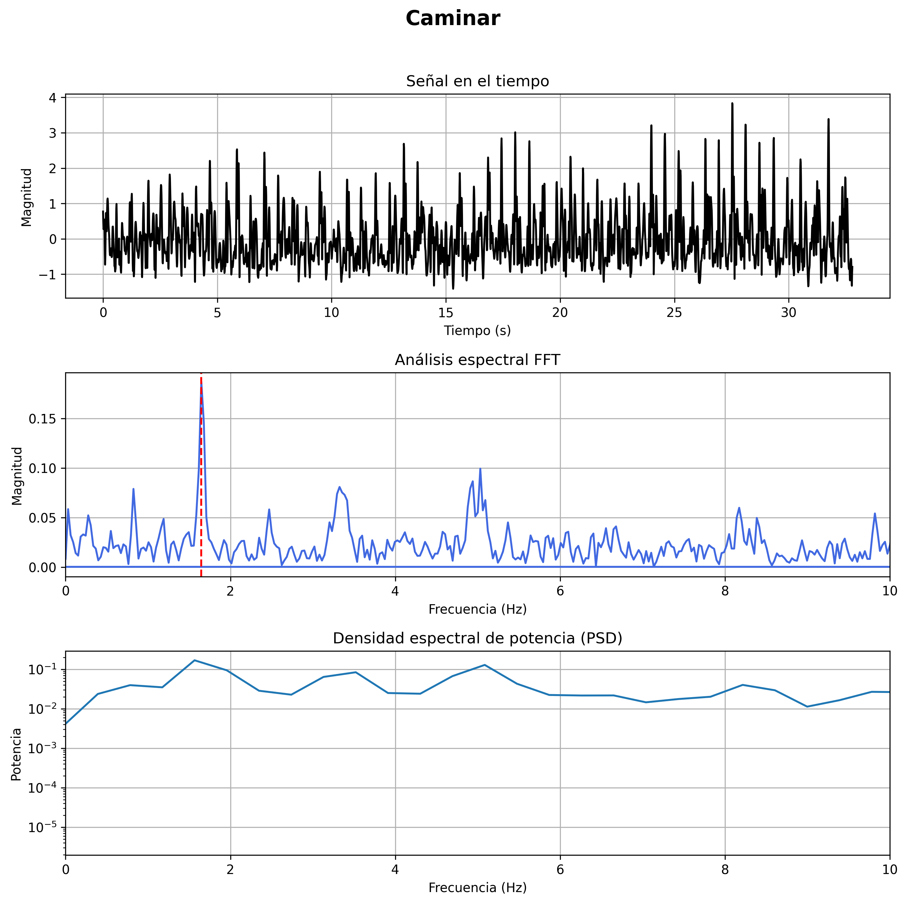
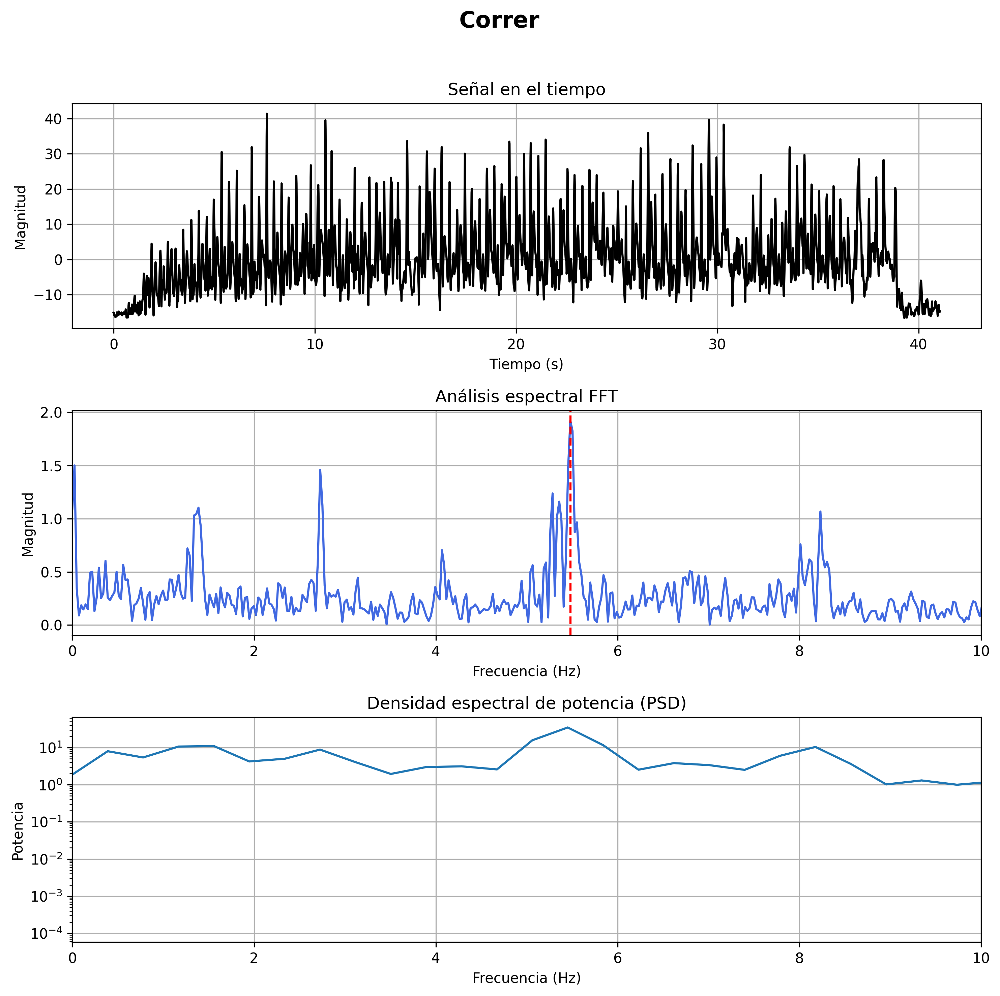
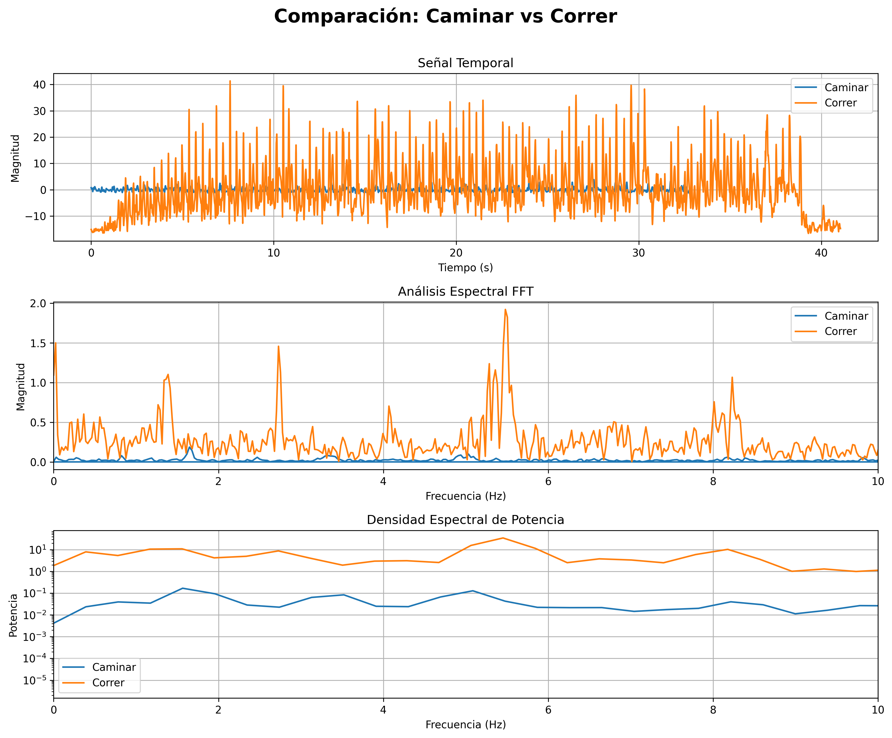
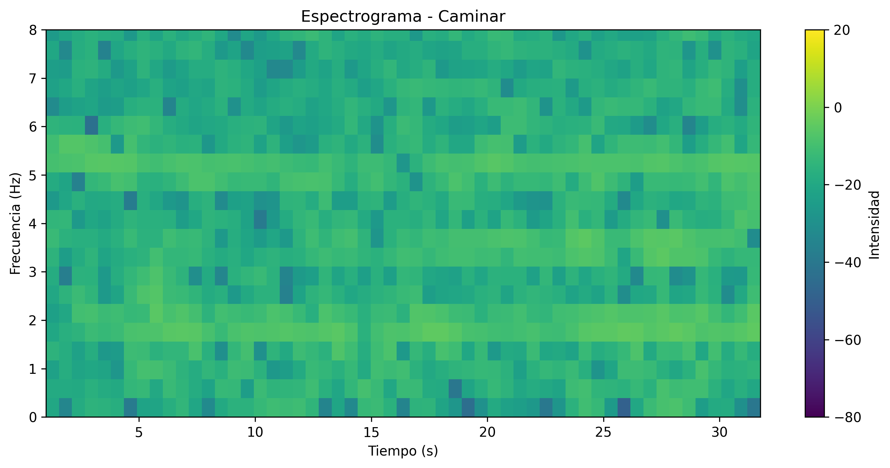
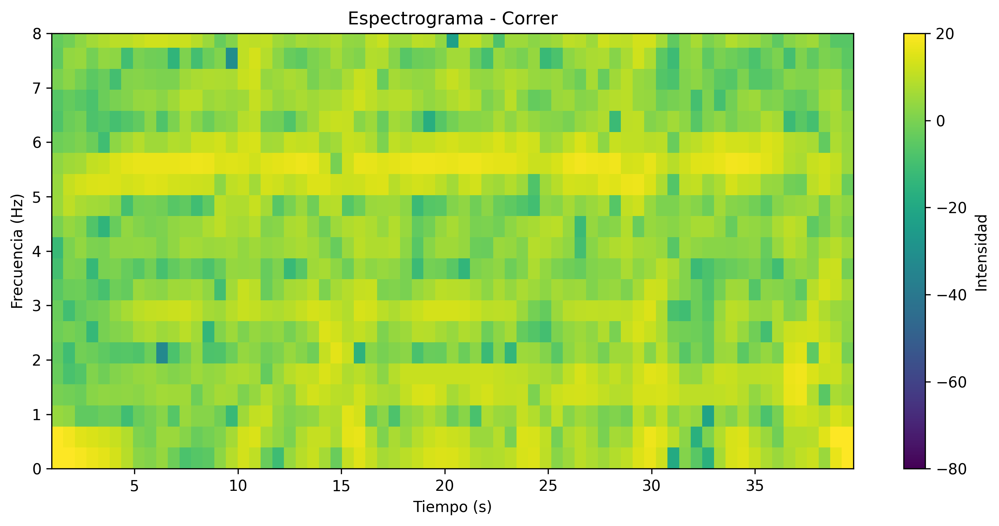
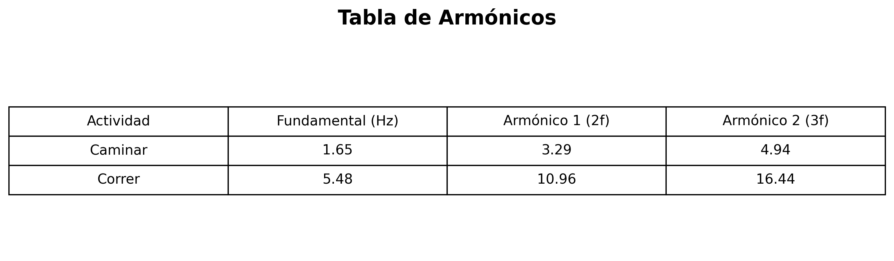

# Reporte Técnico: Análisis Espectral del Movimiento usando el Acelerómetro del Celular
---
## Datos generales

* ### Proyecto: ProyectoAnalisisdeAcelerometro  
* ### Universidad: Universidad Autónoma de Baja California Sur  
* ### Departamento: Departamento Académico de Sistemas Computacionales
* ### Materia: Matemáticas IV  
* ### Integrantes:  
    - Martínez Álvarez Osmar Isaí
    - Oscar Fernando Ramírez Morales
    - Luis Erneto Núñez Sepúlveda

* ### Grupo: ITC TM  
* ### Fecha: 18/05/2026

---

## Introducción

Este reporte presenta el desarrollo y análisis del proyecto **ProyectoAnalisisdeAcelerometro**, cuyo objetivo es procesar datos obtenidos con el acelerómetro de un celular para comparar dos actividades físicas: **caminar** y **correr**.

Los datos fueron registrados con la aplicación **Physics Toolbox Sensor Suite** durante pruebas aproximadas de **42 segundos**. Posteriormente, se analizaron en Python usando herramientas de procesamiento de señales, principalmente la **Transformada Rápida de Fourier (FFT)**, para identificar patrones de frecuencia, cadencia, energía espectral y comportamiento del movimiento.

El proyecto permite observar cómo cambia la señal del acelerómetro entre una actividad de baja intensidad, como caminar, y una de mayor intensidad, como correr.

---

## 1. Objetivo del proyecto

Analizar señales del acelerómetro del celular para identificar diferencias entre caminar y correr mediante herramientas de análisis espectral.

### Objetivos específicos

- Registrar datos reales del acelerómetro en formato CSV.
- Procesar las aceleraciones en los ejes X, Y y Z.
- Obtener una señal de magnitud representativa del movimiento.
- Aplicar FFT para obtener la frecuencia dominante.
- Estimar la cadencia en pasos por minuto.
- Calcular pico máximo y energía espectral.
- Generar gráficas, espectrogramas y tablas comparativas.

---

## 2. Herramientas utilizadas

Para el desarrollo del proyecto se utilizaron las siguientes herramientas:

| Herramienta | Uso |
|---|---|
| Physics Toolbox Sensor Suite | Registro de datos del acelerómetro |
| Visual Studio Code | Edición y ejecución del código |
| Python | Lenguaje principal del proyecto |
| NumPy | Cálculos numéricos y FFT |
| Pandas | Lectura de archivos CSV |
| Matplotlib | Generación de gráficas |
| SciPy | Cálculo de densidad espectral de potencia |

---

## 3. Registro de datos

Los datos se obtuvieron usando el acelerómetro del celular. Se realizaron dos pruebas:

1. **Caminar**
2. **Correr**

Cada prueba tuvo una duración aproximada de **42 segundos**. Los datos fueron exportados en archivos CSV y colocados dentro de la carpeta `datos/`.

```text
datos/caminar.csv
datos/correr.csv
````

El programa utiliza las primeras cuatro columnas de cada archivo:

| Columna | Descripción      |
| ------- | ---------------- |
| 1       | Tiempo           |
| 2       | Aceleración en X |
| 3       | Aceleración en Y |
| 4       | Aceleración en Z |

---

## 4. Procesamiento de la señal

El acelerómetro entrega tres señales diferentes: aceleración en X, Y y Z. Para simplificar el análisis, estas tres componentes se combinan en una sola señal mediante la magnitud vectorial:

```
magnitud = sqrt(ax² + ay² + az²)
```

Después se elimina la componente DC restando el promedio de la señal:

```
magnitud_ac = magnitud - promedio(magnitud)
```

Este paso es importante porque evita que una componente constante, como la gravedad o un desplazamiento de la señal, afecte el análisis de frecuencia.

---

## 5. Análisis espectral con FFT

La **Transformada Rápida de Fourier (FFT)** permite pasar la señal del dominio del tiempo al dominio de la frecuencia. Esto ayuda a identificar qué frecuencias tienen mayor presencia en el movimiento.

En este proyecto, la FFT se utiliza para obtener:

* Frecuencia dominante.
* Cadencia estimada.
* Pico máximo.
* Energía espectral.
* Densidad espectral de potencia.

Antes de aplicar la FFT, se utiliza una ventana Hann para reducir fugas espectrales:

```
senal_window = senal * ventana_hann
```

La frecuencia dominante se obtiene localizando el mayor valor dentro del espectro. Después, la cadencia se estima con:

```
cadencia = frecuencia dominante × 60
```

---

## 6. Resultados numéricos

Al ejecutar el archivo principal `main.py`, se obtuvieron los siguientes resultados:

| Actividad | Frecuencia dominante (Hz) | Cadencia estimada (pasos/min) | Pico máximo | Energía espectral |
| --------- | ------------------------: | ----------------------------: | ----------: | ----------------: |
| Caminar   |                      1.65 |                         98.80 |        3.84 |              0.38 |
| Correr    |                      5.48 |                        328.81 |       41.37 |             63.95 |


---

## 7. Análisis de la actividad: caminar

En la actividad de caminar se obtuvo una frecuencia dominante de **1.65 Hz**, equivalente a una cadencia aproximada de **98.80 pasos por minuto**.

Este resultado es coherente con una actividad de baja intensidad, donde el movimiento del cuerpo es más lento y regular. La energía espectral obtenida fue **0.38**, lo que indica que la señal tiene menor intensidad en comparación con correr.



### Observaciones

* La señal presenta variaciones moderadas en el tiempo.
* La frecuencia dominante se mantiene en un rango bajo.
* La energía espectral es pequeña, indicando menor intensidad de movimiento.

---

## 8. Análisis de la actividad: correr

En la actividad de correr se obtuvo una frecuencia dominante de **5.48 Hz**, equivalente a una cadencia aproximada de **328.81 pasos por minuto**.

El pico máximo fue **41.37** y la energía espectral fue **63.95**, valores mucho mayores que en caminar. Esto indica que correr genera movimientos más intensos, rápidos y con mayor contenido energético.



### Observaciones

* La señal tiene amplitudes mucho mayores que al caminar.
* La frecuencia dominante aumenta considerablemente.
* La energía espectral es más alta, reflejando mayor intensidad de movimiento.

---

## 9. Comparación entre caminar y correr

La comparación entre ambas actividades permite observar diferencias claras tanto en el dominio del tiempo como en el dominio de la frecuencia.



### Análisis comparativo

| Característica            | Caminar | Correr |
| ------------------------- | ------- | ------ |
| Intensidad del movimiento | Baja    | Alta   |
| Frecuencia dominante      | Menor   | Mayor  |
| Pico máximo               | Bajo    | Alto   |
| Energía espectral         | Baja    | Alta   |
| Cadencia estimada         | Menor   | Mayor  |

La actividad de correr presenta valores superiores en todas las métricas principales. Esto confirma que el análisis espectral permite diferenciar actividades físicas usando datos del acelerómetro.

---

## 10. Espectrogramas

El espectrograma permite observar cómo cambia el contenido de frecuencia a lo largo del tiempo.

### Espectrograma de caminar



En caminar, las frecuencias se mantienen principalmente en rangos bajos, lo cual corresponde a un movimiento más constante y menos intenso.

### Espectrograma de correr



En correr, el espectrograma muestra mayor presencia de componentes de frecuencia y más intensidad, lo que refleja cambios más rápidos en la señal.

---

## 11. Armónicos

Además de la frecuencia dominante, se calcularon los armónicos principales. Los armónicos son múltiplos de la frecuencia fundamental y pueden aparecer en movimientos repetitivos.



Para cada actividad se calcularon:

```
Frecuencia fundamental = f
Primer armónico = 2f
Segundo armónico = 3f
```

Estos valores ayudan a observar patrones repetitivos dentro de la señal.

---

## 12. Validación del proyecto

El proyecto cumple con los objetivos planteados porque:

| Criterio                                        | Resultado |
| ----------------------------------------------- | --------- |
| Se registraron datos reales del acelerómetro    | Cumplido  |
| Se procesaron datos de caminar y correr         | Cumplido  |
| Se calculó la magnitud vectorial                | Cumplido  |
| Se eliminó la componente DC                     | Cumplido  |
| Se aplicó FFT para obtener frecuencia dominante | Cumplido  |
| Se estimó la cadencia                           | Cumplido  |
| Se generaron gráficas y espectrogramas          | Cumplido  |
| Se generaron tablas comparativas                | Cumplido  |
| Se compararon ambas actividades                 | Cumplido  |

---

## 13. Conclusiones

El proyecto permitió analizar datos reales del acelerómetro de un celular para comparar las actividades de caminar y correr. Mediante el procesamiento de señal y el uso de FFT, fue posible identificar diferencias claras entre ambas actividades.

La actividad de caminar presentó una frecuencia dominante de **1.65 Hz**, una cadencia aproximada de **98.80 pasos por minuto** y una energía espectral baja. En cambio, correr presentó una frecuencia dominante de **5.48 Hz**, una cadencia estimada de **328.81 pasos por minuto** y una energía espectral mucho mayor.

Estos resultados muestran que el análisis espectral es útil para identificar patrones de movimiento. También se comprobó que señales obtenidas con sensores comunes, como el acelerómetro de un celular, pueden analizarse con herramientas computacionales para extraer información relevante sobre la actividad física.

---

## 14. Archivos generados

Al ejecutar el proyecto se generan los siguientes archivos dentro de la carpeta `resultados/`:

```
resultados/comparacion_caminar_correr.png
resultados/espectrograma_caminar.png
resultados/espectrograma_correr.png
resultados/graficas_caminar.png
resultados/graficas_correr.png
resultados/tabla_armonicos.png
resultados/tabla_comparativa.png
```

---

**Reporte compilado:** 18/05/2026

**Versión:** 1.0

**Estado:** Proyecto completado
 

